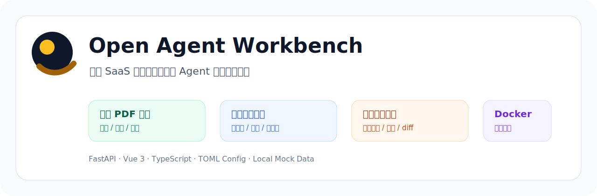
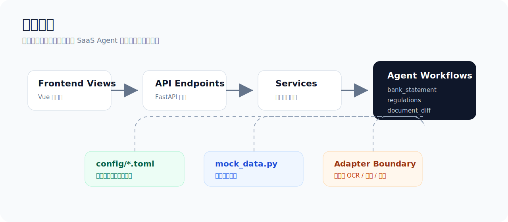
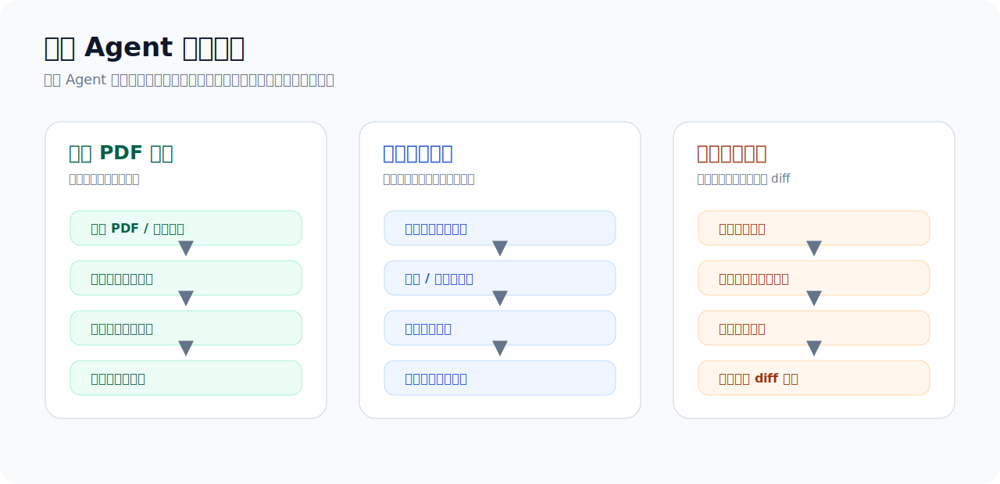

# Open Agent Workbench

<p align="center">
  
</p>

<p align="center">
  
  
  
  
</p>

面向 SaaS 业务场景的后端 Agent 流程演示项目，覆盖账单 PDF 解析、规则文本比对、版本差异比对，包含任务编排、状态流转、结果复核、报告输出、脱敏兜底与 Docker 本地部署示例。

这个项目更偏**后端工程方案展示**，前端只是一个轻量工作台，用来触发接口、查看任务状态和浏览 mock 结果。

## 适合用来做什么

- 演示多步骤 Agent 后端流程如何拆分 API、service、workflow 和 adapter。
- 展示文件类任务从上传、解析、校验、复核到报告输出的基本形态。
- 作为 FastAPI + Vue + Docker 的本地全栈 demo。
- 给后续接入 OCR、模型网关、对象存储、数据库、任务队列提供可替换边界。

## 模块概览

| 模块 | 说明 |
| --- | --- |
| 账单 PDF 解析 | 演示文件入库、PDF 拆页、OCR 坐标、结构化行识别、金额校验、问题页和报告输出 |
| 规则文本比对 | 演示源文本与参考文本的语义比对、风险项归一化、文本定位和兜底匹配 |
| 版本差异比对 | 演示基准文档与多个版本文档的差异任务、状态轮询、预览链接和本地 diff |
| 流程市场 | 用一个简单入口展示可进入的 workflow demo |

## 架构预览

<p align="center">
  
</p>

<p align="center">
  
</p>

## 技术栈

| 层级 | 技术 |
| --- | --- |
| Backend | FastAPI、Pydantic、Uvicorn |
| Frontend | Vue 3、TypeScript、Vite |
| Runtime | uv、Node.js |
| Deploy | Docker、Docker Compose、Nginx |
| Config | TOML、`.env` |
| Data | 本地 mock 数据 |

## 快速开始

### 后端

```powershell
cd backend
uv sync
uv run uvicorn app.main:app --host 0.0.0.0 --port 8001 --reload
```

API 文档：

```text
http://localhost:8001/docs
```

### 前端

```powershell
cd frontend
npm install
npm run dev
```

访问：

```text
http://localhost:5173
```

### 一键启动

```powershell
.\start-dev.ps1
```

## Docker

```powershell
Copy-Item .env.example .env
docker compose --env-file .env up --build
```

默认地址：

| 服务 | 地址 |
| --- | --- |
| 前端 | `http://localhost:5173` |
| 后端 | `http://localhost:8001` |
| Swagger | `http://localhost:8001/docs` |

常用配置：

```text
FRONTEND_PORT=5173
BACKEND_PORT=8001
CONFIG_PATH=/app/config/config.toml
```

## 后端设计

后端按比较常见的工作流分层组织：

```text
API endpoints
  -> services
    -> agents
      -> platform adapters
        -> mock data
```

`backend/app/platform` 放的是可替换的基础设施适配器：

| 组件 | 用途 |
| --- | --- |
| `file_pipeline.py` | 上传、解压、拆页、渲染、页面分类 |
| `ocr.py` | 文本块、坐标、置信度和清洗 |
| `model_gateway.py` | 模型任务、重试记录、兜底策略 |
| `parsers.py` | CSV/JSON 解析和字段标准化 |
| `repository.py` | 内存任务、状态机、复核记录 |
| `queue.py` | 本地队列和 worker 行为模拟 |
| `storage.py` | 对象元数据和 checksum |
| `audit.py` | 审计事件、调用计数、租户上下文 |
| `reporting.py` | 报告元数据和下载地址描述 |

更细的流程说明见 [docs/backend-workflows.md](docs/backend-workflows.md)。

可替换 adapter 和扩展点见 [docs/extension-points.md](docs/extension-points.md)。

## 常用接口

| 场景 | 接口 |
| --- | --- |
| 流程市场 | `GET /api/v1/market/agents` |
| PDF 任务列表 | `GET /api/v1/bank_statement/projects` |
| PDF 完整流程 | `POST /api/v1/bank_statement/projects/{project_id}/engineering-pipeline` |
| 单页识别 | `GET /api/v1/bank_statement/projects/{project_id}/single-page-recognition?page=1` |
| 文本比对任务 | `GET /api/v1/regulations/tasks` |
| 文本比对完整流程 | `POST /api/v1/regulations/tasks/{task_id}/engineering-pipeline` |
| 差异历史 | `GET /api/v1/document_diff/history` |
| 差异完整流程 | `POST /api/v1/document_diff/engineering-pipeline` |

## 目录结构

```text
open-agent-workbench
├─ backend
│  ├─ app/api
│  ├─ app/services
│  ├─ app/agents
│  ├─ app/platform
│  └─ app/mock_data.py
├─ frontend
├─ config
├─ docs
├─ docker-compose.yaml
└─ start-dev.ps1
```

## 开发检查

```powershell
cd backend
$env:UV_CACHE_DIR = ".uv-cache"
uv run ruff check .
```

```powershell
cd frontend
npm run build
```

```powershell
docker compose --env-file .env.example config --quiet
```

## 数据与边界

- 仓库只包含 mock 数据和演示文件名。
- 不包含真实业务文件、真实账号、真实客户信息或敏感配置。
- 默认不连接外部 OCR、模型网关、对象存储、数据库或消息队列。
- 如果要接入真实服务，建议只替换 `backend/app/platform` 下的 adapter。
- Prompt、OCR、报告和存储等扩展方式见 [docs/extension-points.md](docs/extension-points.md)。

## Design Note

这个项目的模块划分、流程拆分和 adapter 分层思路，基本来自个人对 SaaS 后端文件类任务的整理与抽象，不基于某个现成开源项目模板或外部项目代码。仓库中的示例数据、流程命名和页面内容均为本地 demo 设计，用于展示后端 workflow 的组织方式；如果与其他项目在通用流程上存在相似点，通常属于同类工程问题下的常见抽象。

## Contact

如果你对流程编排、文档解析、OCR/LLM adapter 接入、业务规则建模或本地部署有进一步交流需求，可以联系：

- Email: 1070410058@qq.com

## License

当前仓库暂未声明开源 License。使用或二次分发前请自行确认授权边界。
